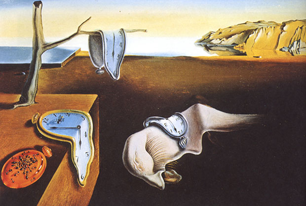

---

# Welcome to my website! 

---

* I'm a second-year MPH student at [Columbia University, Mailman School of Public Health](https://www.mailman.columbia.edu). 

* You can learn about my professional and academic experience [here](about.html).

* Here's one of my favorite paintings: The Persistence of Memory (1931) by Salavador Dalí

---

# Solo Or Together? 

---

* [Solo Or Together?](https://gagarinzhao.github.io/billboard_band_breakups/) is a small passion project our team (Gagarin Zhao, Meeraj Kothari, Madeline Cannon, Crystal Li, Nihan Gencerliler) did for our Data Science class. We visualized band breakups by comparing the success of bands when they are together and when they become solo acts according to Billboard Hot 100 data. 